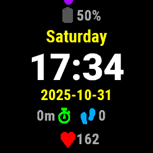

# Funktional - Garmin Watchface



A minimalist and functional watchface for Garmin smartwatches.

## Features

- **Time Display**: Shows time in HH:MM format (24-hour or 12-hour based on system settings)
- **Day of Week**: Displayed above the time
- **Date**: Displayed below the time in YYYY-MM-DD format
- **Seconds Indicator**: A rotating dot that circles the watchface, completing one full rotation every minute
- **Health & Activity Metrics**:
  - Heart Rate (HR)
  - Steps count
  - Active minutes
  - Battery percentage

## Project Structure

```
funktional/
├── manifest.xml           # App manifest and configuration
├── monkey.jungle          # Build configuration
├── source/
│   ├── FunktionalApp.mc   # Main application entry point
│   └── FunktionalView.mc  # Watchface view implementation
└── resources/
    ├── strings.xml        # String resources
    ├── layouts.xml        # Layout definitions
    └── drawables.xml      # Drawable resources
```

## Building

To build this project, you'll need:

1. **Garmin Connect IQ SDK**: Download from [Garmin Connect IQ](https://developer.garmin.com/connect-iq/sdk/)
2. **Visual Studio Code** with the **Monkey C** extension (optional but recommended)

### Using the SDK

```bash
# Compile the project
monkeyc -o bin/funktional.prg -f monkey.jungle -y /path/to/developer_key

# Run in simulator
connectiq
```

### Using VS Code

1. Install the "Monkey C" extension from Garmin
2. Open the project folder
3. Press F5 to build and run in the simulator

## Compatible Devices

This watchface is compatible with:
- Fenix 5, 5 Plus, 6, 7 series
- Vivoactive 3, 4 series
- Venu, Venu 2 series
- Forerunner 245, 945, 955 series

Additional devices can be added in the `manifest.xml` file.

## Customization

The watchface can be customized by editing `source/FunktionalView.mc`:
- Colors: Modify the `Graphics.COLOR_*` constants
- Layout: Adjust text positions and sizes
- Indicators: Change which metrics are displayed or their positions

## License

This project is open source and available for personal use and modification.

